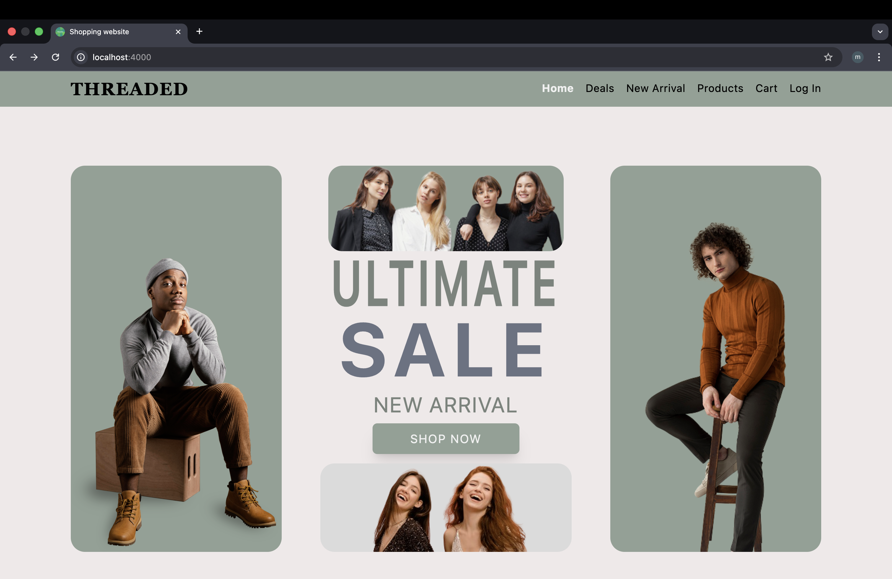
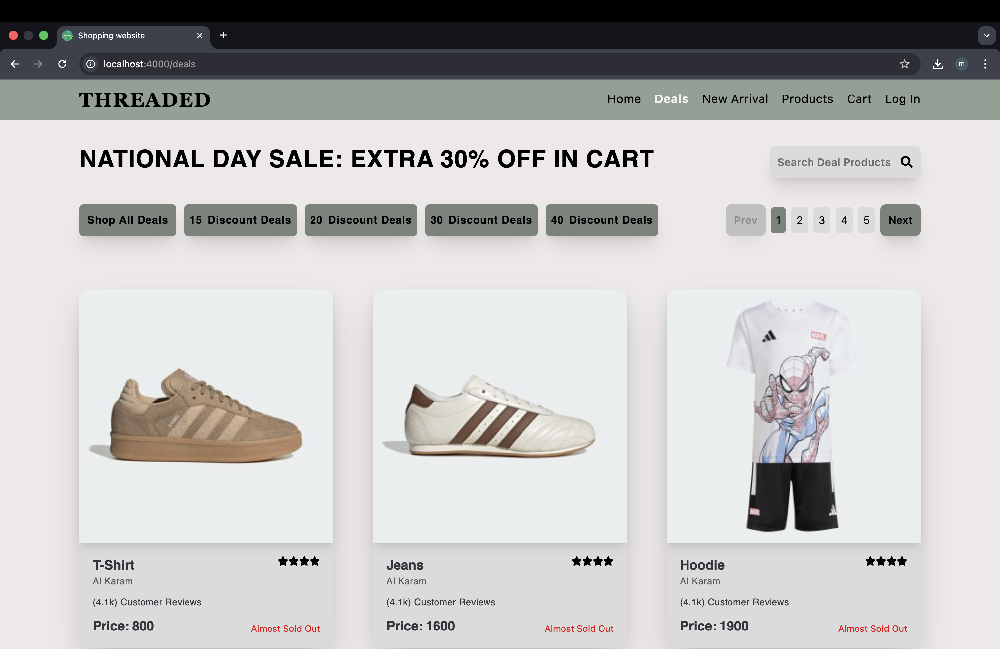
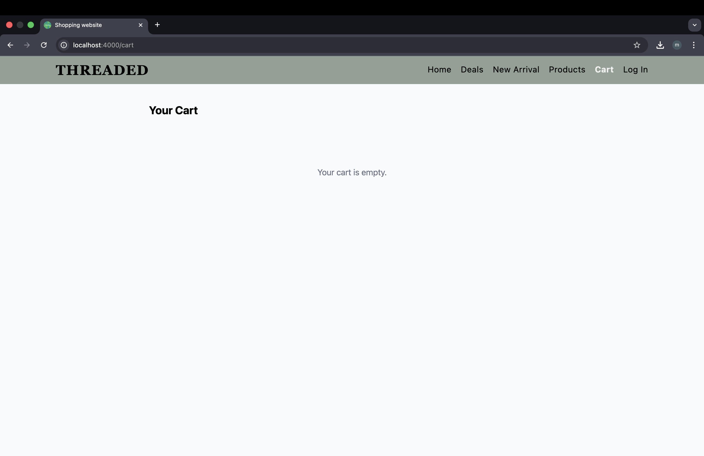
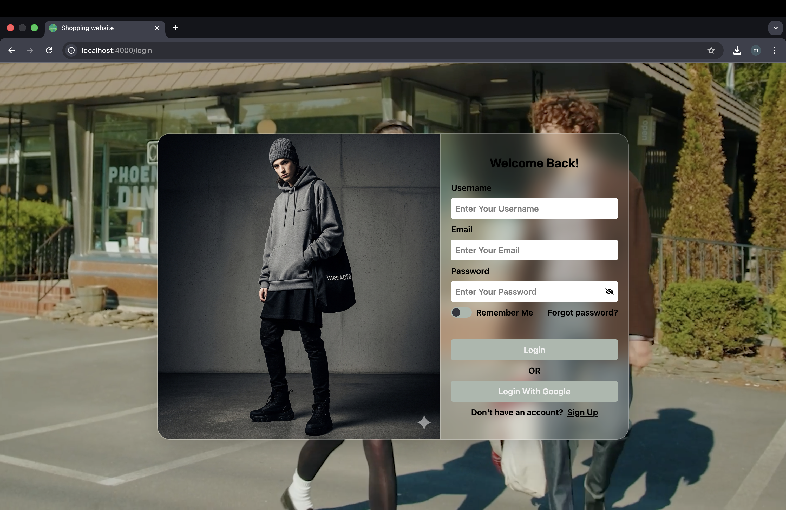
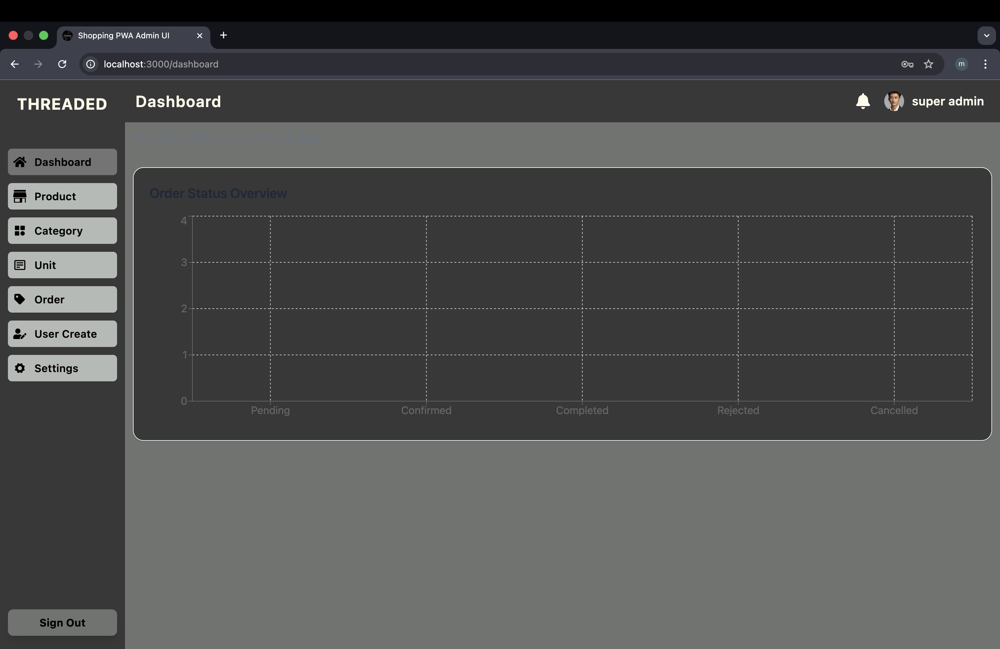

# Shopping PWA

<p align="center">
  A full-stack shopping web application built during my mentorship journey —<br/>
  my first serious step into React and full-stack development.
</p>

<p align="center">
  <a href="https://shopping-website-delta-five.vercel.app">Customer Demo</a>
  ·
  <a href="https://shopping-pwa-admin-ui.vercel.app">Admin Demo</a>
  ·
  <a href="https://github.com/Min-Thant794/shopping-backend">Backend Repo</a>
  ·
  <a href="https://github.com/Min-Thant794/shopping-pwa-admin-ui">Admin Repo</a>
</p>

<p align="center">
  
  
  
  
  
  
</p>

---

## Overview

A full-stack e-commerce platform with a customer storefront, admin dashboard, and REST API backend. Built during my mentorship program, this was my first time connecting React, a database, authentication, and real-time communication into one working product.

The system lives across **three separate repositories**, each run independently.

| Part | Repo | Live |
|------|------|------|
| Customer Website | [shoppingWebsite](https://github.com/Min-Thant794/shoppingWebsite) | [shopping-website-delta-five.vercel.app](https://shopping-website-delta-five.vercel.app) |
| Backend API | [shopping-backend](https://github.com/Min-Thant794/shopping-backend) | — |
| Admin Dashboard | [shopping-pwa-admin-ui](https://github.com/Min-Thant794/shopping-pwa-admin-ui) | [shopping-pwa-admin-ui.vercel.app](https://shopping-pwa-admin-ui.vercel.app) |

---

## Architecture

```text
Customer Website (React + Vite)
          │
          ├── Axios (REST) + Socket.IO (real-time)
          │
          ▼
Backend API (Node.js + Express + MongoDB + Redis + Socket.IO)
          ▲
          │
          └── Admin Dashboard (React + Vite)
```

---

## Features

### Customer Website
- Product browsing with deals and new arrivals sections
- User authentication (sign up / log in)
- Shopping cart management
- Real-time backend connectivity via Socket.IO
- Smooth animations with Framer Motion
- Toast notifications for user feedback
- Client-side routing with React Router

### Admin Dashboard
- Order monitoring and management
- Real-time order status updates via Socket.IO
- Order analytics with Recharts visualizations
- Role-aware navigation and protected routes

### Backend API
- RESTful routes with Express
- MongoDB + Mongoose for data persistence
- JWT-based authentication
- Redis integration
- Socket.IO for real-time events
- File and image handling via Multer + Supabase
- CORS configured for multi-client architecture

---

## Tech Stack

**Customer Website** — `React` `Vite` `React Router DOM` `Axios` `Tailwind CSS` `Framer Motion` `Swiper` `Socket.IO Client` `React Toastify`

**Admin Dashboard** — `React` `Vite` `React Router DOM` `Axios` `Tailwind CSS` `Recharts` `Socket.IO Client` `React Toastify`

**Backend** — `Node.js` `Express` `MongoDB` `Mongoose` `JWT` `Redis` `Socket.IO` `Multer` `Supabase` `CORS` `Dotenv`

---

## Getting Started

Each repository is run independently. Clone all three, then set them up one by one.

### 1. Clone

```bash
git clone https://github.com/Min-Thant794/shoppingWebsite.git
git clone https://github.com/Min-Thant794/shopping-backend.git
git clone https://github.com/Min-Thant794/shopping-pwa-admin-ui.git
```

### 2. Install dependencies

Run inside each repository:

```bash
npm install
```

### 3. Configure environment variables

**Backend `.env`**
```env
PORT=4000
MONGODB_URL=your_mongodb_connection_string
JWT_SECRET=your_jwt_secret
REDIS_URL=your_redis_connection_string
SUPABASE_URL=your_supabase_url
SUPABASE_KEY=your_supabase_key
```

**Frontend / Admin `.env`**
```env
VITE_API_BASE_URL=your_backend_api_url
VITE_SOCKET_URL=your_backend_socket_url
```

### 4. Run

```bash
# Customer website
cd shoppingWebsite && npm run dev

# Admin dashboard
cd shopping-pwa-admin-ui && npm run dev

# Backend
cd shopping-backend && npm start
```

---

## Screenshots

### Customer Experience

<p align="center">
  
</p>

<p align="center">
  
  
</p>

### Authentication

<p align="center">
  
</p>

### Admin Dashboard

<p align="center">
  
</p>
```

---

## What I Learned

- Structuring a React app with reusable components
- Connecting a frontend to a backend REST API with Axios
- Handling JWT authentication and protected routes end to end
- Using MongoDB and Mongoose in a real application
- Implementing real-time updates with Socket.IO
- Organizing and deploying a multi-repository full-stack project
- Building separate admin and customer interfaces against the same API

---

## Planned Improvements

- [ ] Add screenshots and UI previews
- [ ] Document the payment workflow
- [ ] Add product search and filtering
- [ ] Write API documentation
- [ ] Improve test coverage
- [ ] Add deployment guides for all three repositories

---

## Author

**Min Thant Tun** — [@Min-Thant794](https://github.com/Min-Thant794)

> Built as part of a mentorship program — the project where I first experienced how frontend, backend, database, and real-time features come together.
